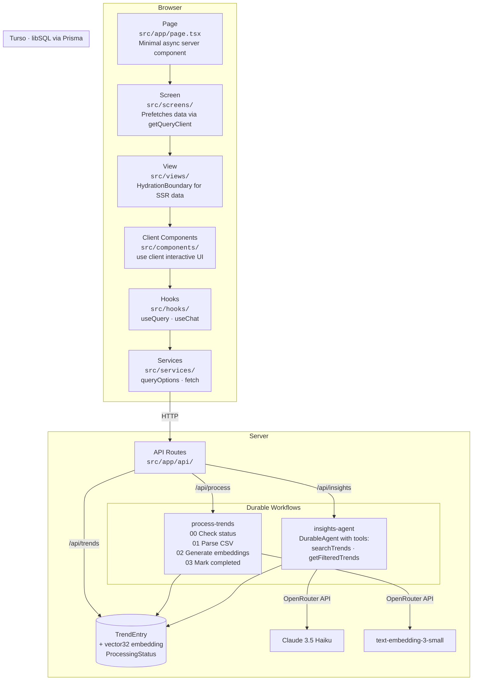
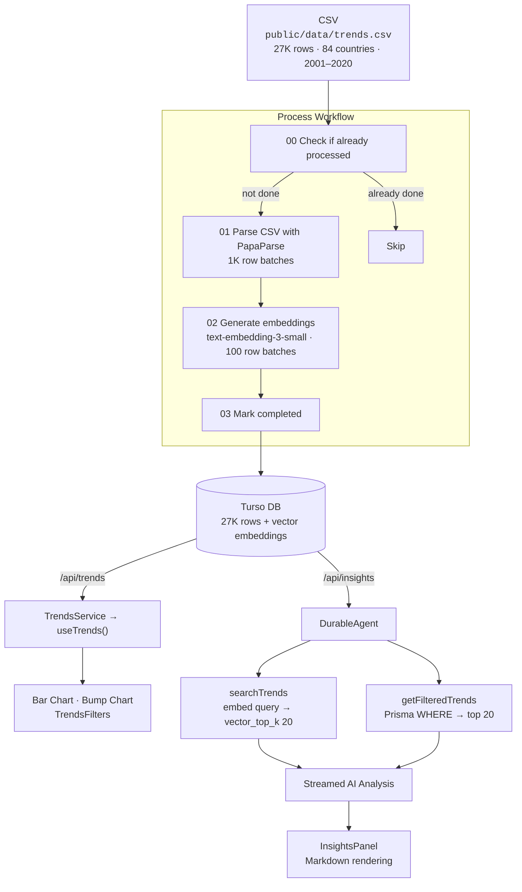

# Google Search Trends Explorer

An interactive dashboard for exploring 27K+ Google Search Trends across 84 countries (2001–2020) with AI-powered insights. Built with Next.js 16, durable workflows, and the Vercel AI SDK.

## Architecture

The project follows a **Page → Screen → View** layering pattern where each layer has a clear responsibility:



### Data Flow



## Features

### Dashboard
- **Bar chart** of top 25 trends ranked by score, with tooltips showing rank, category, location, and year
- **Bump chart** showing rank progression over time for up to 8 multi-year trends (visible when both category and location filters are applied)
- **Filter controls** for year, location (dropdown), and category (searchable popover)
- **Dark/light mode** toggle via `next-themes`

### Data Processing
- One-click CSV ingestion via a durable workflow with progress tracking
- Batch processing: CSV parsed in 1K row chunks, embeddings generated in batches of 100
- Resilient retry handling with `RetryableError` on every step
- Real-time progress bar showing `{processed} / {total}` rows

### AI Insights Chat
- Natural language Q&A about the trends data powered by Claude 3.5 Haiku
- Tool-use agent with two capabilities:
  - **`searchTrends`** — vector similarity search over embeddings for semantic queries
  - **`getFilteredTrends`** — direct Prisma query with exact filters for structured lookups
- Streamed responses rendered as rich Markdown (headings, lists, bold, code blocks, tables, links)
- Inline tool call indicators with spinner → checkmark state transitions
- Chat history persisted to `localStorage`

## Getting Started

### Prerequisites
- [Bun](https://bun.sh/) runtime
- [Turso](https://turso.tech/) database (or local libSQL)
- [OpenRouter](https://openrouter.ai/) API key (for embeddings and AI agent)

### Setup

```bash
# Install dependencies
bun install

# Set up environment variables
cp .env.example .env.local
# Edit .env.local with your Turso and OpenRouter credentials

# Generate Prisma client and run migrations
bunx prisma generate --schema prisma/schema.prisma
bunx prisma migrate deploy --schema prisma/schema.prisma

# Start the dev server
bun run dev
```

Open [http://localhost:3000](http://localhost:3000). Click **"Process Data"** to ingest the CSV dataset, then explore trends and ask the AI agent questions.

### Environment Variables

| Variable | Description |
|---|---|
| `TURSO_DATABASE_URL` | Turso/libSQL connection URL |
| `TURSO_AUTH_TOKEN` | Turso authentication token |
| `OPENROUTER_API_KEY` | OpenRouter API key for AI models |

## Scripts

```bash
bun run dev          # Start dev server (http://localhost:3000)
bun run build        # Production build
bun run lint         # Lint with Biome (biome check)
bun run format       # Auto-format with Biome (biome format --write)
```

## Project Structure

```
src/
├── app/
│   ├── api/
│   │   ├── hello/route.ts            # Example endpoint
│   │   ├── insights/
│   │   │   ├── route.ts              # POST: start insights agent
│   │   │   └── [runId]/stream/       # GET: resume workflow stream
│   │   ├── process/route.ts          # POST: start ingestion, GET: poll status
│   │   └── trends/route.ts           # GET: filtered trends + metadata
│   ├── globals.css                   # Tailwind v4 theme + shadcn tokens
│   ├── layout.tsx                    # Root layout with providers
│   └── page.tsx                      # Entry point → TrendsScreen
├── components/
│   ├── ui/                           # shadcn primitives (Button, Card, etc.)
│   ├── InsightsPanel.tsx             # AI chat with markdown + tool indicators
│   ├── ProcessingPanel.tsx           # CSV ingestion progress UI
│   ├── RankBumpChart.tsx             # Multi-line rank progression chart
│   ├── TrendsChart.tsx               # Horizontal bar chart (top 25)
│   ├── TrendsDashboard.tsx           # Main dashboard layout
│   ├── TrendsFilters.tsx             # Year/location/category filters
│   └── ThemeToggle.tsx               # Dark/light mode switch
├── hooks/
│   ├── useInsights.ts                # useChat + WorkflowChatTransport
│   ├── useProcessingStatus.ts        # Polls /api/process every 2s
│   └── useTrends.ts                  # useQuery(TrendsService.getTrends)
├── lib/
│   ├── db.ts                         # Prisma client with libsql adapter
│   ├── query.tsx                     # QueryClient factory (per-request/singleton)
│   ├── types.ts                      # TrendsFilters, TrendsData interfaces
│   └── utils.ts                      # cn() classname helper
├── providers/
│   ├── QueryProvider.tsx             # TanStack React Query + devtools
│   └── ThemeProvider.tsx             # next-themes wrapper
├── screens/
│   └── TrendsScreen.tsx              # Server prefetch + dehydrate
├── server/workflows/
│   ├── insights-agent/               # DurableAgent with search tools
│   └── process-trends/               # 4-step CSV → DB → embeddings pipeline
├── services/
│   └── trends-service.ts             # queryOptions() for trends API
└── views/
    └── TrendsView.tsx                # HydrationBoundary + dashboard
```

## Tech Stack

| Category | Technology | Version |
|---|---|---|
| **Framework** | Next.js (App Router, React Compiler) | 16.1.6 |
| **Runtime** | React | 19.2.3 |
| **Workflows** | Vercel Workflow DevKit | 4.1.0-beta.60 |
| **AI** | Vercel AI SDK + OpenRouter | ai 6.0.105 |
| **AI Model** | Claude 3.5 Haiku (via OpenRouter) | — |
| **Embeddings** | text-embedding-3-small (via OpenRouter) | — |
| **Database** | Turso (libSQL) + Prisma ORM | Prisma 7.4.2 |
| **State** | TanStack React Query | 5.90.21 |
| **UI** | Radix UI via shadcn | 1.4.3 |
| **Charts** | Recharts | 2.15.4 |
| **Styling** | Tailwind CSS v4 + tw-animate-css | 4.x |
| **Markdown** | react-markdown + remark-gfm | 10.1.0 |
| **Linter** | Biome | 2.2.0 |
| **Package Manager** | Bun | — |

## Database Schema

**TrendEntry** — stores individual trend records with vector embeddings for similarity search:

| Column | Type | Description |
|---|---|---|
| `id` | Int (PK) | Auto-increment primary key |
| `location` | String | Country name |
| `year` | Int | Year (2001–2020) |
| `category` | String | Trend category |
| `rank` | Int | Rank position |
| `query` | String | Search query text |
| *embedding* | vector32 | Vector embedding (managed via raw SQL) |

Indexed on `(location, year, category)` and `query`.

**ProcessingStatus** — tracks the CSV ingestion workflow state:

| Column | Type | Description |
|---|---|---|
| `id` | Int (PK) | Auto-increment primary key |
| `status` | String | `pending` / `processing` / `completed` / `failed` |
| `total` | Int | Total rows in CSV |
| `processed` | Int | Rows with generated embeddings |
| `error` | String? | Error message if failed |

## License

MIT
